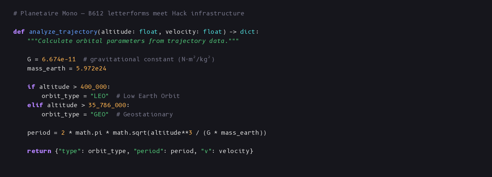
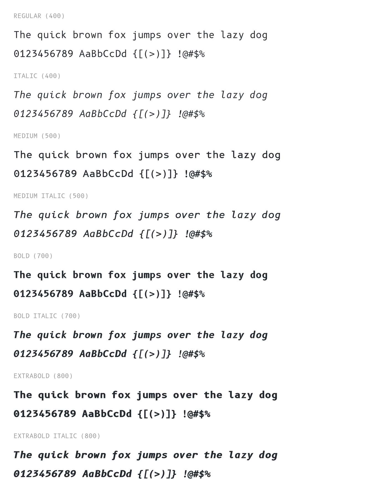
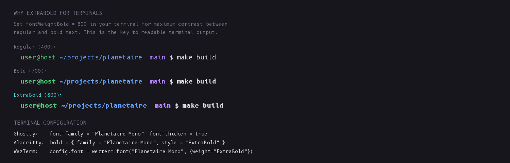
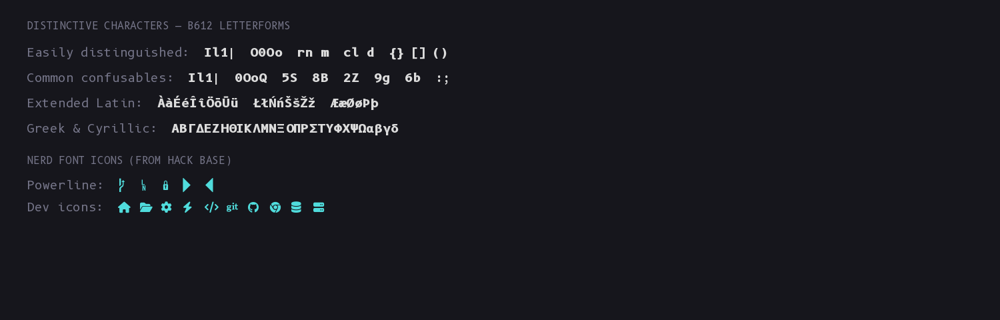

# Planetaire Mono

A monospace font for terminals that combines [B612](https://b612-font.com/)'s
highly legible letterforms with [Hack](https://sourcefoundry.org/hack/)'s
complete programming infrastructure and
[Nerd Font](https://www.nerdfonts.com/) icons.



## Why

B612 was designed by Intactile Design for Airbus cockpit displays — optimized for
reading under stress, at odd angles, and in poor lighting. Its letterforms are
among the most legible ever designed for monospace text.

But B612 alone isn't a complete programming font. It lacks the punctuation refinements,
symbol coverage, and icon ecosystem that developers need. Planetaire Mono solves this
by merging B612's letters and digits into Hack Nerd Font's base, combining the best of
both:

- **B612 letterforms** for letters, digits, and extended Latin/Greek/Cyrillic
- **Modified zero** — B612's zero with a center dot added for clear `0` vs `O`
  disambiguation, with circle (default) and rectangle (ss01) variants
- **Hack punctuation and symbols** for `{}[]()<>` and everything else
- **12,000+ Nerd Font icons** including Powerline, Font Awesome, and Devicons

## Weights

Planetaire Mono ships with **8 variants** across 4 weights:

| Variant | Weight | Recommended Use |
|---------|--------|-----------------|
| Regular | 400 | Normal terminal text |
| Italic | 400 | Emphasized text |
| Medium | 500 | UI labels, intermediate weight |
| Medium Italic | 500 | UI labels italic |
| Bold | 700 | Standard bold |
| Bold Italic | 700 | Standard bold italic |
| **ExtraBold** | **800** | **Terminal bold text** |
| **ExtraBold Italic** | **800** | **Terminal bold italic** |



### ExtraBold for Terminals

The jump from Regular (400) to standard Bold (700) is often too subtle at terminal
font sizes. **ExtraBold (800) provides the visual punch that makes bold text — prompts,
headings, highlighted output — actually stand out.** This is the recommended bold weight
for terminal use.

Configure your terminal to use ExtraBold for bold text:

```
# Ghostty
font-family = "Planetaire Mono"
font-thicken = true

# Alacritty
[font.bold]
family = "Planetaire Mono"
style = "ExtraBold"

# WezTerm
config.font_rules = {{
  intensity = 'Bold',
  font = wezterm.font('Planetaire Mono', { weight = 'ExtraBold' }),
}}

# VS Code terminal
"terminal.integrated.fontWeightBold": "800"
```

See [docs/terminal-config.md](docs/terminal-config.md) for complete configuration
examples for Ghostty, Alacritty, WezTerm, iTerm2, Kitty, and VS Code.



## Character Coverage



B612's letterforms make commonly confused characters easy to tell apart:
`Il1|` (I, l, 1, pipe), `O0o` (O, zero, o), `rn` vs `m`, `5S`, `8B`, `2Z`.

Coverage includes Latin Extended A/B, Greek and Coptic, Cyrillic, and Latin Extended
Additional — over 12,000 glyphs total.

## Install

### Download

Download the latest release from
[GitHub Releases](https://github.com/jlevy/planetaire/releases):

- `PlanetaireMono.tar.xz` (recommended, smallest)
- `PlanetaireMono.zip`

### macOS

```bash
# Download and extract
curl -L https://github.com/jlevy/planetaire/releases/latest/download/PlanetaireMono.tar.xz | tar xJ
# Install
cp PlanetaireMono-*.ttf ~/Library/Fonts/
```

### Linux

```bash
# Download and extract
curl -L https://github.com/jlevy/planetaire/releases/latest/download/PlanetaireMono.tar.xz | tar xJ
# Install
mkdir -p ~/.local/share/fonts/PlanetaireMono
cp PlanetaireMono-*.ttf ~/.local/share/fonts/PlanetaireMono/
fc-cache -fv
```

## Build from Source

Planetaire Mono is built with a Python pipeline that uses
[fontTools](https://github.com/fonttools/fonttools) for binary font manipulation.

### Prerequisites

- Python 3.12+
- [uv](https://docs.astral.sh/uv/) (recommended) or pip

### Build

```bash
# Install dependencies
uv sync --all-extras

# Download source fonts and build all variants
make fonts

# Or step by step:
uv run planetaire build download        # download source fonts
uv run planetaire build planetaire-mono  # build all 8 variants
uv run planetaire validate fonts/output/*.ttf  # validate output
```

Built fonts are written to `fonts/output/`.

### CLI

The `planetaire` CLI exposes the individual operations for inspection and debugging:

```bash
planetaire info fonts/output/PlanetaireMono-Regular.ttf
planetaire compare font-a.ttf font-b.ttf --ranges 0041-005A
planetaire validate fonts/output/*.ttf
```

## How It Works

The build pipeline:

1. **Merge** — Copies B612 glyphs (letters, digits 0-9, extended Latin, Greek, Cyrillic)
   into the Hack Nerd Font base, normalizing UPM from Hack's 2048 to B612's 2000
2. **Dotted zero** — Adds a center dot to B612's zero for `0`/`O` disambiguation,
   with circle (default) and rectangle (ss01/zero) OpenType alternate variants
3. **Rename** — Sets font family metadata to "Planetaire Mono" with correct
   PostScript names and weight classes
4. **Fix** — Adds required tables (DSIG), sets embedding flags (fsType=0), and
   configures grid-fitting (GASP)
5. **Validate** — Checks glyph coverage, weight metadata, and OpenType features

This is repeated for all 8 variants (Regular, Italic, Medium, MediumItalic,
Bold, BoldItalic, ExtraBold, ExtraBoldItalic).

## Credits

- [**B612**](https://b612-font.com/) — Intactile Design for Airbus
  ([polarsys/b612](https://github.com/polarsys/b612)). The letterforms that make this
  font special.
- [**Hack**](https://sourcefoundry.org/hack/) — Chris Simpkins. The base font
  providing punctuation, symbols, and overall metrics.
- [**Nerd Fonts**](https://www.nerdfonts.com/) — Ryan McIntyre. 12,000+ developer
  icons including Powerline, Font Awesome, Devicons, and more.
- [**carlosedp**](https://github.com/carlosedp/b612) — Carlos
  Eduardo de Paula's B612 fork with ligatures and Nerd Font patching, which
  inspired the dotted zero design. Not a build dependency.

## License

Planetaire Mono is released under the
[SIL Open Font License 1.1](https://openfontlicense.org/) (OFL-1.1).

The constituent source fonts carry the following licenses:
- **B612**: OFL-1.1 + EPL-2.0
- **Hack**: MIT License
- **Nerd Fonts** patches: MIT License

See [fonts/source/licenses/](fonts/source/licenses/) for full license texts.

The build tooling (this repository's Python code) is under the
[MIT License](LICENSE).
